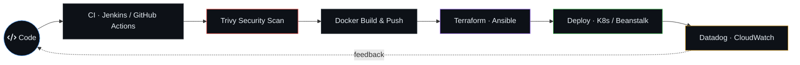

<div align="center">


<br/><br/>

[](https://profile.theenuka.xyz)
[](https://www.linkedin.com/in/theenuka-bandara-659a2a32b)
[](mailto:theenukabandara@gmail.com)

</div>

## About

DevOps (Platform) Engineer Intern at **Sysco LABS Sri Lanka** and Computer Engineering undergrad at the **University of Ruhuna**. Selected from **7,000+ applicants** for the **WSO2 Linux Systems Administration & DevOps Engineering Training Program**, a 6-month intensive I completed before joining Sysco LABS.

I care about the boring things that make software reliable: infrastructure as code, CI/CD, observability, and platforms that let developers ship without thinking about the plumbing.

```text
Now       →  DevOps (Platform) Engineer Intern @ Sysco LABS
Certified →  AWS Solutions Architect – Associate (SAA-C03)
Trained   →  WSO2 Linux SysAdmin & DevOps Engineering Program (6 months, 7,000+ applicants)
Learning  →  CKA · Kubestronaut path (KCNA → KCSA → CKAD → CKA → CKS)
```

## How I Ship



## Stack

| | |
|---|---|
| **Cloud** | AWS (EC2 · EKS · S3 · RDS · VPC · IAM · ELB · CloudFront · ElastiCache) · GCP (GKE · GCE) |
| **Kubernetes** | EKS · GKE · Helm · kubeadm (self-hosted clusters) |
| **Platform Engineering** | Backstage · ArgoCD · Concourse CI · WSO2 Asgardeo |
| **IaC** | Terraform · Ansible · CloudFormation |
| **CI/CD** | Jenkins · GitHub Actions · GitLab CI · AWS CodePipeline |
| **Containers** | Docker · Docker Compose · Trivy |
| **Observability** | Datadog · CloudWatch · SNS |
| **Languages** | Python · Bash · Ruby · Java · JavaScript · C++ |

## Featured Work

**[Phoenix Booking](https://github.com/theenuka)** · *WSO2 Capstone, Team Lead (10 engineers)*
Cloud-native hotel reservation system on a **self-hosted 5-node Kubernetes cluster**. Provisioned with Terraform + Ansible, IAM via WSO2 Asgardeo.
`Kubernetes` `Terraform` `Ansible` `Asgardeo`

**[DevSecOps Pipeline](https://github.com/theenuka/Freights-Management-System)**
**7-stage Jenkins pipeline** for a 5-service containerized app: Terraform provisioning, Ansible Vault secrets, Trivy scanning, ALB path-based routing with TLS, CloudWatch + SNS alerting.
`Jenkins` `Terraform` `Trivy` `Ansible Vault` `CloudWatch`

**[AWS CI/CD Pipeline](https://github.com/theenuka)**
Fully automated delivery pipeline with **AWS CodePipeline + CodeBuild**, deploying a Java app to Elastic Beanstalk with an RDS backend. **Cut deployment time from 60 minutes to 10.**
`CodePipeline` `CodeBuild` `Beanstalk` `RDS` `Maven`

**[Cloud-Native Re-Architecting](https://github.com/theenuka/AWS-Re-Archichitectoring-Project)**
Replaced self-managed EC2 services with AWS managed equivalents: RDS, ElastiCache, Amazon MQ, Elastic Beanstalk, CloudFront + ACM.
`Beanstalk` `RDS` `ElastiCache` `CloudFront`

**[AWS Lift & Shift](https://github.com/theenuka/AWS-Lift-and-Shift-project)**
Migrated a multi-tier Java stack (Tomcat, MySQL, RabbitMQ, Memcached) to EC2 with **ALB across 3 AZs**, Auto Scaling, custom AMIs, and an isolated data tier.
`EC2` `ALB` `ASG` `Route53`

**[Multi-Tier Local Stack](https://github.com/theenuka)**
Where it all started: a **5-VM distributed system** orchestrated with Vagrant + VirtualBox. Nginx reverse proxy, Tomcat, RabbitMQ, Memcached, MySQL, hardened with firewalld and automated DNS host mapping.
`Vagrant` `Nginx` `Tomcat` `MySQL` `firewalld`

## Beyond the Terminal

♟️ FIDE-rated chess player (~1641 classical) · 🏆 **1st place @ HaXtreme hackathon**

<div align="center">


</div>
